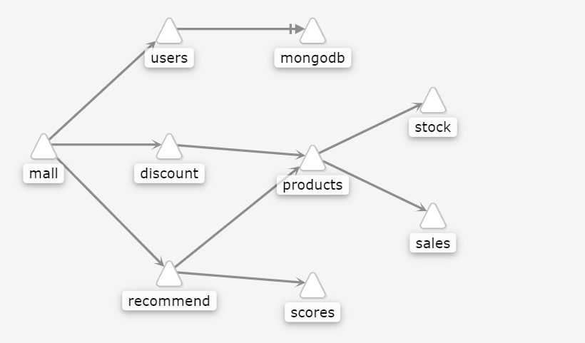

##  在线商城系统

在线电子商城，属于多语言微服务系统，包括 nodejs、golang、ruby、python 和 java，整个系统由大概 11 个微服务项目组成。

服务调用拓扑关系：




## 基准测试

首先部署所有服务的 v1 版本，创建流量治理策略

* kubectl apply -f deploy/mesh-mall-v1.yaml -n mesh

* kubectl apply -f deploy/mesh-routing.yaml -n mesh

## 多分支环境场景

- jason 希望验证推荐系统 recommend 新版本 v2, 这个版本在「推荐商品」区域上增加了一个 banner。
- 与此同时, fox 正打算验证另一个的 feature: 包括对 discount 和 products 的修改, 同时引入了新的收藏服务 favorites. 
其中 discount v2 在「折扣商品」区域上新增一个 banner, 同时 products 服务会通过调用新的服务 favorites 获取商品的收藏人数, 然后返回给前端页面。


while true; do curl -H "cookie:user=jason"  http://10.40.30.136:31004/api/mall | jq .recommend.banner ;sleep 1;done;

```
  % Total    % Received % Xferd  Average Speed   Time    Time     Time  Current
                                 Dload  Upload   Total   Spent    Left  Speed
100  1110  100  1110    0     0  35806      0 --:--:-- --:--:-- --:--:-- 37000
true
  % Total    % Received % Xferd  Average Speed   Time    Time     Time  Current
                                 Dload  Upload   Total   Spent    Left  Speed
100  1111  100  1111    0     0  46291      0 --:--:-- --:--:-- --:--:-- 46291
true
  % Total    % Received % Xferd  Average Speed   Time    Time     Time  Current
                                 Dload  Upload   Total   Spent    Left  Speed
100  1113  100  1113    0     0  31800      0 --:--:-- --:--:-- --:--:-- 31800
true
```

```
while true; do curl -H "cookie:user=xx"  http://10.40.30.136:31004/api/mall | jq .recommend.banner ;sleep 1;done;
  % Total    % Received % Xferd  Average Speed   Time    Time     Time  Current
                                 Dload  Upload   Total   Spent    Left  Speed
100  1062  100  1062    0     0  10114      0 --:--:-- --:--:-- --:--:-- 10018
false
  % Total    % Received % Xferd  Average Speed   Time    Time     Time  Current
                                 Dload  Upload   Total   Spent    Left  Speed
100  1068  100  1068    0     0  20538      0 --:--:-- --:--:-- --:--:-- 20538
false
  % Total    % Received % Xferd  Average Speed   Time    Time     Time  Current
                                 Dload  Upload   Total   Spent    Left  Speed
100  1064  100  1064    0     0  22166      0 --:--:-- --:--:-- --:--:-- 22638
false
  % Total    % Received % Xferd  Average Speed   Time    Time     Time  Current
                                 Dload  Upload   Total   Spent    Left  Speed
100  1063  100  1063    0     0  23108      0 --:--:-- --:--:-- --:--:-- 23108
false
```

### 参考

https://github.com/TencentCloudContainerTeam/tcm-demo

https://zhonghua.io/2019/06/26/tke-mesh-demo/